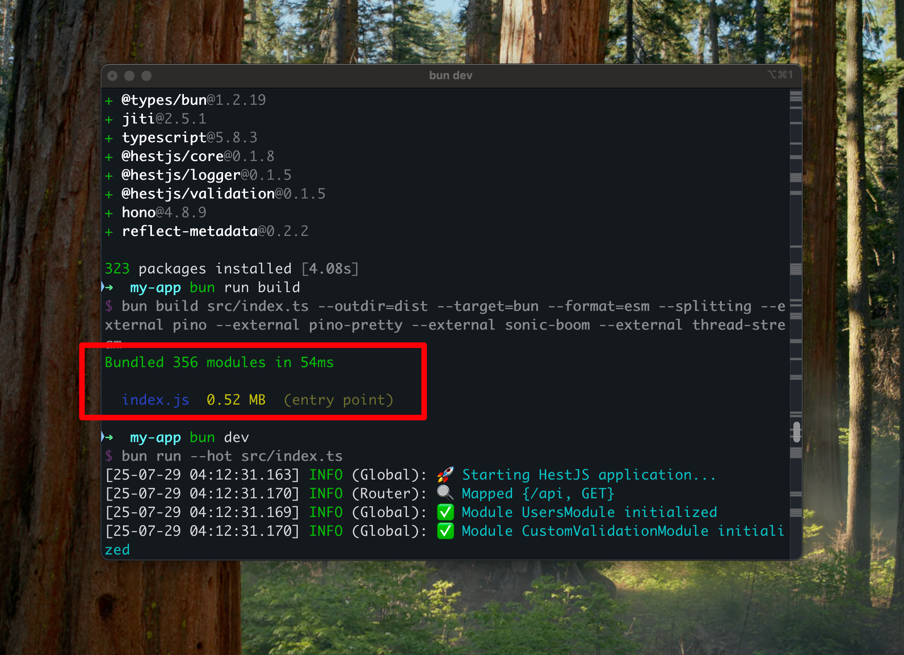
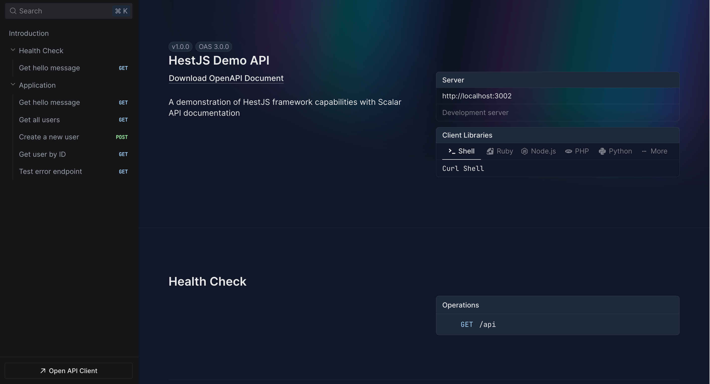

# HestJS 介绍

HestJS 是一个基于 **Hono + Bun + TSyringe** 的现代化 TypeScript 库，提供类似 NestJS 的开发体验，但具有更轻量和更高性能的特点, 构建速度极快，构建产物极小。

## 🎯 核心特性

### 装饰器驱动开发

HestJS 采用装饰器驱动的开发模式，让你可以使用熟悉的语法来定义控制器、服务、中间件等组件：

```typescript
import { Controller, Get, Post, Body } from '@hestjs/core';
import { Context } from 'hono';

@Controller('/api/users')
export class UserController {
  constructor(private readonly userService: UserService) {}

  @Get()
  async findAll(c: Context) {
    const users = await this.userService.findAll();
    return c.json(users);
  }

  @Post()
  async create(@Body(CreateUserDto) createUserDto: CreateUserDto, c: Context) {
    const user = await this.userService.create(createUserDto);
    return c.json(user);
  }
}
```

### 强大的依赖注入

基于 TSyringe 实现的完整依赖注入容器，支持构造函数注入、属性注入等多种注入方式：

```typescript
@injectable()
export class UserService {
  constructor(
    private readonly userRepository: UserRepository,
    private readonly logger: Logger
  ) {}
}
```

### 模块化架构

采用模块系统组织代码，支持模块间的依赖和导入：

```typescript
@Module({
  imports: [DatabaseModule, LoggerModule],
  controllers: [UserController],
  providers: [UserService, UserRepository],
  exports: [UserService]
})
export class UserModule {}
```

### 高性能运行时

- **Hono**: 极速的 Web 框架，比 Express 快数倍
- **Bun**: 高性能的 JavaScript 运行时，启动速度快，内存占用低
- **原生 TypeScript**: 直接支持 TypeScript，无需编译步骤

#### 极速构建体验

HestJS 凭借 Bun 的强大性能，实现了业界领先的构建速度：



*构建速度极快（以 demo 应用为例），让开发体验更加流畅，大大提升开发效率*

### 类型安全的验证系统

基于 TypeBox 的强大验证功能，提供运行时类型检查和自动类型推导：

```typescript
export class CreateUserDto {
  @IsString({ minLength: 2, maxLength: 50 })
  name!: string;

  @IsEmail()
  email!: string;

  @IsNumber({ minimum: 18, maximum: 120 })
  age!: number;
}
```

### CQRS 支持

内置命令查询职责分离模式支持，帮助构建复杂的业务逻辑：

```typescript
@CommandHandler(CreateUserCommand)
export class CreateUserHandler implements ICommandHandler<CreateUserCommand> {
  async execute(command: CreateUserCommand): Promise<User> {
    // 处理命令逻辑
  }
}
```

### 丰富的扩展功能

- **日志系统**: 基于 Pino 的高性能日志
- **API 文档**: 基于 Scalar 的 OpenAPI 集成
- **中间件系统**: 灵活的 Hono 中间件机制
- **错误处理**: 完善的异常处理中间件

#### 精美的 API 文档界面

HestJS 集成了现代化的 Scalar 文档系统，提供精美、专业的 Swagger 文档体验：



*精心设计的 Swagger 文档界面，提供直观的 API 探索体验和在线测试功能*

## 🔄 与 NestJS 的对比

| 特性            | HestJS   | NestJS          |
| --------------- | -------- | --------------- |
| 运行时          | Bun      | Node.js         |
| Web 框架        | Hono     | Express/Fastify |
| 启动速度        | 极快     | 较慢            |
| 内存占用        | 低       | 较高            |
| TypeScript 支持 | 原生     | 需要编译        |
| 依赖注入        | TSyringe | 自研            |
| 学习曲线        | 平缓     | 陡峭            |
| 生态系统        | 新兴     | 成熟            |

## 🎯 适用场景

HestJS 特别适合以下场景：

### 高性能 API 服务

- 需要极高性能的 REST API
- 微服务架构（demo 应用构建产物约 0.5MB）
- 实时数据处理

### 现代化开发

- 喜欢 TypeScript 开发
- 追求快速启动和开发体验
- 需要类型安全的验证

### 团队协作

- 从 NestJS 迁移的项目
- 需要标准化的代码结构
- 希望降低学习成本

## 🚀 下一步

准备开始使用 HestJS？请查看以下指南：

1. [安装和环境配置](./installation.md) - 设置开发环境
2. [创建第一个应用](./first-application.md) - 构建你的第一个 HestJS 应用
3. [项目结构说明](./project-structure.md) - 了解项目组织方式
4. [CLI 工具使用](./cli-usage.md) - 掌握命令行工具

## 📚 更多资源

- [基础概念](../fundamentals/controllers.md) - 学习核心概念
- [模块系统](../fundamentals/modules.md) - 理解模块化架构
- [依赖注入](../fundamentals/dependency-injection.md) - 掌握 DI 系统
- [项目结构](./project-structure.md) - 了解项目组织

---

**下一步**: [安装和环境配置 →](./installation.md)
